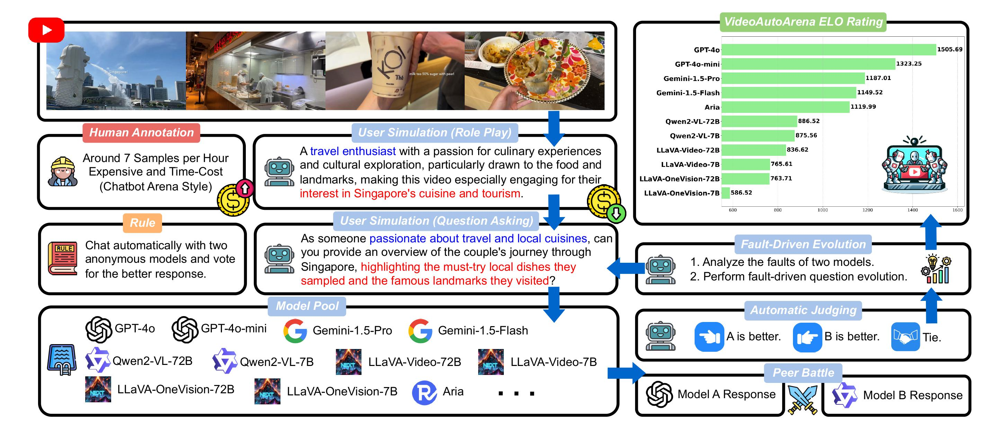

# VideoAutoArena

| [📄 Paper](https://arxiv.org/abs/2411.13281) | [🌐 Project Page](https://videoautoarena.github.io/) | [🏆 Leaderboard](https://videoautoarena.github.io/) |

**VideoAutoArena** is an automated benchmark for evaluating large multimodal models (LMMs) in video analysis. Inspired by LMSYS Chatbot Arena, it simulates user-generated, open-ended questions to rigorously assess model performance. The framework employs a modified ELO Rating System for continuous, fair comparisons and a fault-driven evolution strategy to progressively increase question complexity, challenging models with more demanding tasks. The evaluation pipeline is illustrated below:



If you want to streamline the evaluation process while maintaining a user-centric approach, you can try our [VideoAutoBench](https://github.com/VideoAutoArena/VideoAutoBench), which blends the efficiency of traditional benchmarks with the user-focused evaluation of VideoAutoArena, similar to MT-Bench and AlpacaEval.

## 🛠️ Installation

To set up VideoAutoArena, follow these steps:

```bash
git clone https://github.com/VideoAutoArena/VideoAutoBench.git
cd VideoAutoArena
pip install -r requirements.txt
```

This will clone the repository and install all necessary dependencies.

## 🎯 Evaluation

### Step 1: Generate Model Responses

1. Obtain the LongVideoBench Dataset  

Download and prepare the LongVideoBench dataset by following the [instructions provided here](https://github.com/longvideobench/LongVideoBench?tab=readme-ov-file#custom-use-load-the-longvideobench-dataset).

Use the following Python script to load the dataset:

```python
# Ensure you use VideoAutoArena's src/load_longvideobench.py
from longvideobench import LongVideoBenchDataset

dataset = LongVideoBenchDataset(YOUR_DATA_PATH_TO_LVB, "lvb_test_wo_gt.json", max_num_frames=128)

# Example: Load video contents
video_id = "@jonijawne-7305429122044497157"
video_contents = dataset.get_w_video_id(video_id)["inputs"]  # Returns a list of PIL.Images and subtitles
```

2. Generate Model Responses  

For each sample, VideoAutoArena provides a persona, a question, responses from previous LMM battles, and GPT-4o judge results. Your LMM will replace one of the existing models in the battle and compete against the other. Use the following script to sample battle data:

```bash
cd src
python sampling.py \
    --n_sample 1500 \
    --battle_file "data/battle.history.w.judge.json" \
    --LMM_name "Name of your LMM" \
    --output_path "data/your.LMM.battle.json"
```

Use `video_contents` along with the provided questions in `data/your.LMM.battle.json` to generate your model's responses.  

> **Important**: Exclude "persona" information from the input to your model.  

Format your responses as follows:

```json
[
    {
        "video_id": "T1zSZFiqEgg",
        "qid": "T1zSZFiqEgg_1",
        "persona": "A person who is a foodie vlogger, regularly ...",
        "question": "Can you describe ...",
        "model a": "GPT4o",
        "model b": "Name of your LMM",
        "model a answer": "The vlogger's reaction to the ...",
        "model b answer": "Yes! The video ..."
    },
    ...
]
```

> **Note**: Your LMM can serve as either `model a` or `model b`. Ensure that its response is placed correctly under `model a answer` or `model b answer`.

3. (Optional) Fault-Driven Evolution  

To iteratively increase question complexity, apply the fault-driven evolution strategy as described below:

```bash
export OPENAI_API_KEY=XXXXXX  # Replace with your OpenAI API key
export LVB_PATH=YYYYYY        # Replace with the path to your LongVideoBench dataset

python evol.py \
    --battle_path "/path/to/your/battle/file.json" \
    --output_dir "/path/to/evolved/questions" \
    --worker_num 2  # Adjust based on your hardware capacity

python gather.py \
    --input_dir "/path/to/evolved/questions" \
    --output_file "/path/to/new/battle/file/with/evolved/questions.json"
```

> **Note**: For each evolved question, you must generate responses for both competing LMMs, not just your own.


### Step 2: Generate GPT-4o Judgments

Use GPT-4o to evaluate your model's performance against the rival.

1. Set Up Environment  

Ensure your environment is properly configured:

```bash
cd src
export OPENAI_API_KEY=XXXXXX  # Replace with your OpenAI API key
export LVB_PATH=YYYYYY        # Replace with your LongVideoBench path
```

2. Run the Judging Script  

Run the judging script to obtain GPT-4o evaluations:

```bash
python lmm_judge.py \
    --battle_path "/path/to/your/battle/file.json" \
    --output_dir "/path/to/save/judge/results" \
    --worker_num 2  # Adjust based on your hardware capacity
```

### Step 3: View VideoAutoArena Scores

After generating GPT-4o judgments, you can calculate your model’s ELO score to assess its performance.

1. Run the Scoring Script  

Execute the scoring script using the following command:

```bash
python get_score.py \
    --history_path "data/battle.history.w.judge.json" \
    --input_dir "/path/to/save/judge/results"
```

2. Interpret the Results  

The script will produce two key metrics:

- **Pairwise Win Fractions**: Shows how often each model outperforms others in head-to-head comparisons.
- **Bradley-Terry ELO Ratings**: Provides a relative ranking of model performance based on their pairwise results.

> **Note**: The battle history file is dynamic and updates with new battle results. Consequently, leaderboard scores will evolve as more battles are conducted.

## 📬 Contact

If you would like your LMM's performance included on our leaderboard, please email your GPT-4o judge results (compress `/path/to/save/judge/results` into a zip file) to us. For any questions or further inquiries, contact us at `chiyeunglaw1@gmail.com`.


## 📜 License

This dataset follows the **CC-BY-NC-SA 4.0** license. Please use this dataset for **non-commercial purposes ONLY**.

For more information, see the [Creative Commons License](https://creativecommons.org/licenses/by-nc-sa/4.0/).


## 📖 Citation

If you find this project useful, please cite our work:

```bibtex
@article{
    luo2024videoautoarena,
    title={VideoAutoArena: An Automated Arena for Evaluating Large Multimodal Models in Video Analysis through User Simulation}, 
    author={Ziyang Luo and Haoning Wu and Dongxu Li and Jing Ma and Mohan Kankanhalli and Junnan Li},
    year={2024},
    eprint={2411.13281},
    archivePrefix={arXiv},
    primaryClass={cs.CV},
    url={https://arxiv.org/abs/2411.13281}, 
}
```